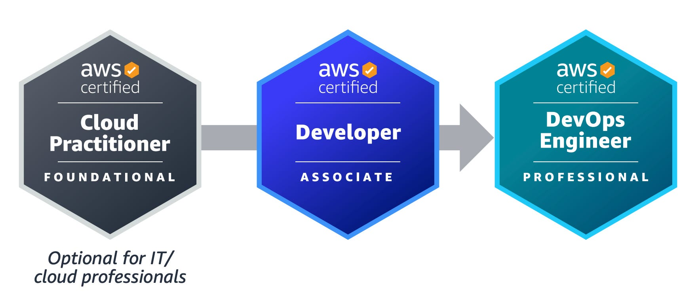
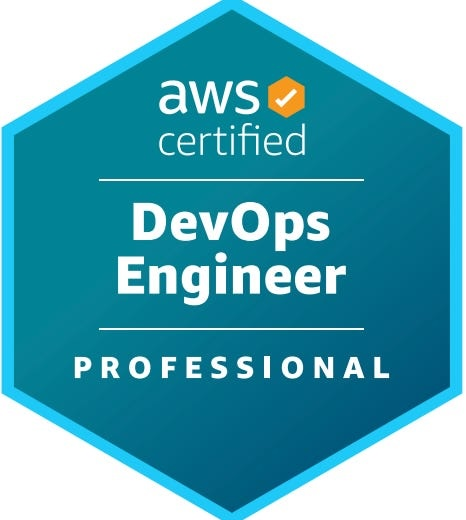
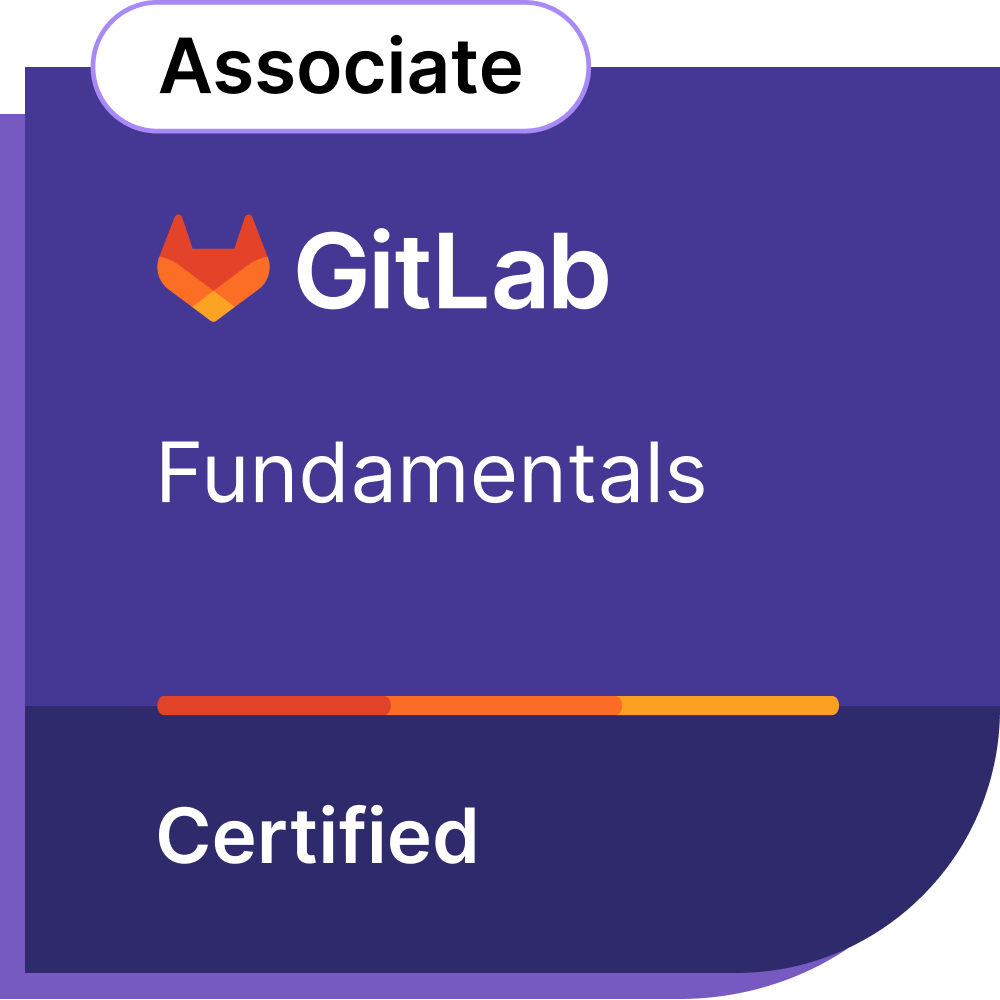
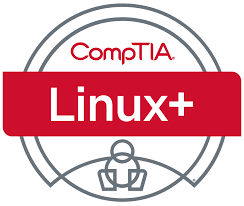
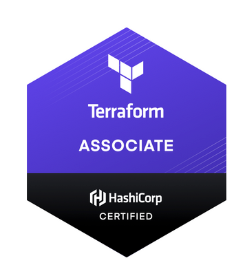
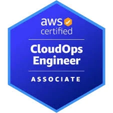

---

---

| Certification                            | Progress                             | Next Steps                    |
|------------------------------------------|--------------------------------------|-------------------------------|
| { width=200 } | 

25%

 | Complete practice exams and other stuff to see if the table keeps expanding?  yes this is currently expanding.   
 <a href="">course details</a>       |
| { width=200 } | 

0%

 | API documentation review      |
| { width=130 } | 

0%

 | API documentation review      |

---
Other Certifications in mind (update as i go along):

{ width=200 }
{ width=200 }
{ width=200 }
{ width=200 }
https://www.qa.com/resources/blog/announcing-the-aws-certified-cloudops-engineer-associate-soa-c03-exam/

https://university.platformengineering.org/introduction-to-platform-engineering
{ width=200 } https://www.virtualbadge.io/certificate-validator?credential=e78799ea-12f4-424f-8e1f-3e50e92c83b6

